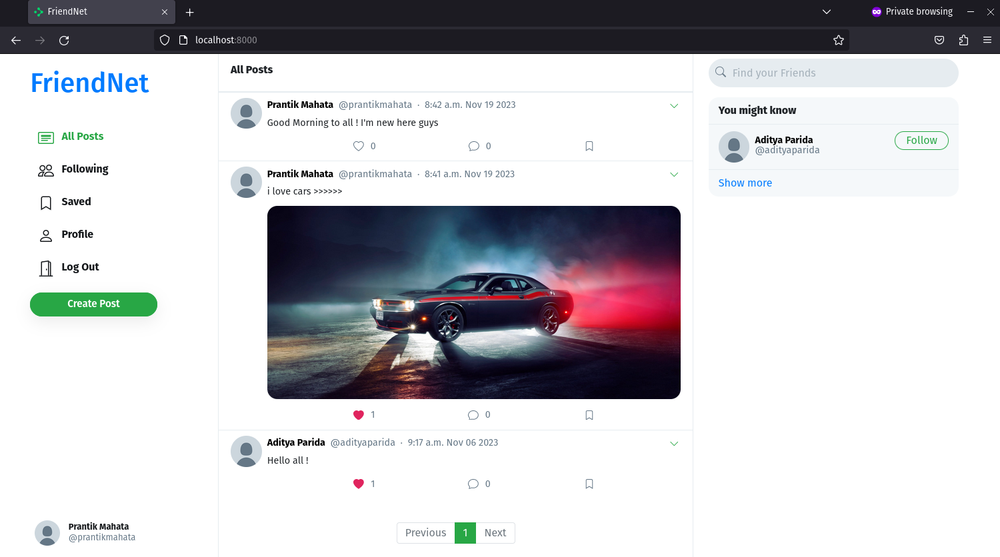

# FriendNet
This is a social media application built using Django and Python. It provides users with the ability to create accounts, connect with friends, share posts, and interact with each other's content.




## Features

-User Registration and Authentication
-User Profile Management
-Create, Edit, and Delete Posts
-Like and Comment on Posts
-Follow and Unfollow Other Users
-Account Settings


## Installation

+ Fork this repository

+ Clone the repository
  ```
  git clone git@github.com:your-username/FriendNet.git
  ```
  
+ Install the requirements
  ```
  pip install -r requirements.txt
  ```
  
+ Make the required migrations
  ```
  python manage.py makemigrations
  ```
  ```
  python manage.py migrate
  ```

+ To run the development server
  ```
  python manage.py runserver
  ```

+ Open your web browser and visit http://localhost:8000 to access the application.

## Usage

Once the application is up and running, users can access the registration page to create a new account. After logging in, they can start using the social media features such as creating posts, connecting with friends, and interacting with content.

## [Contribution](./docs/contribution.md)

## Acknowledgments

This application was built using Django, a high-level Python web framework. Special thanks to the Django community for their contributions and support.


  
